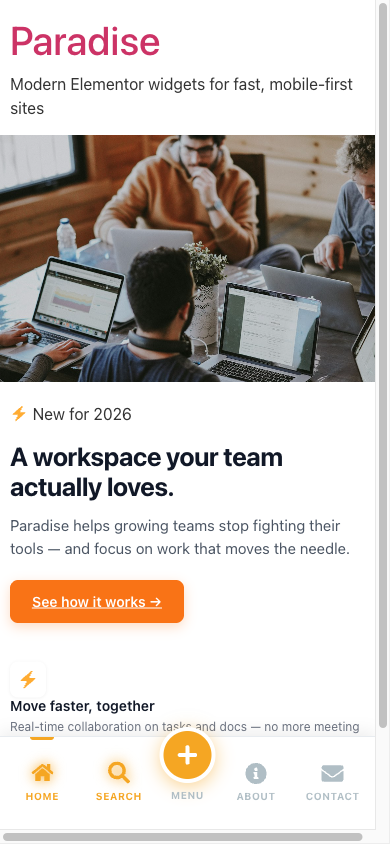
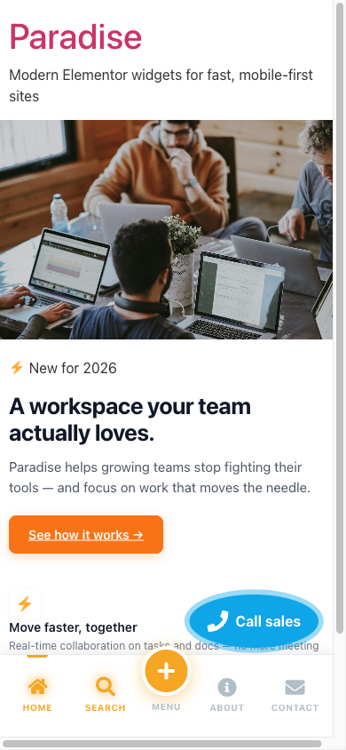
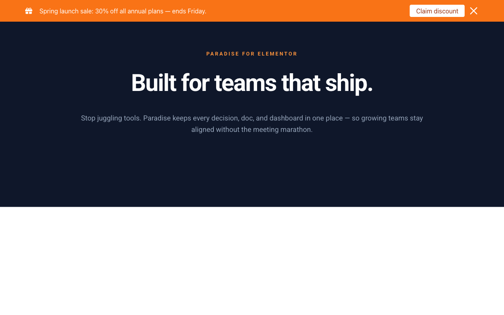
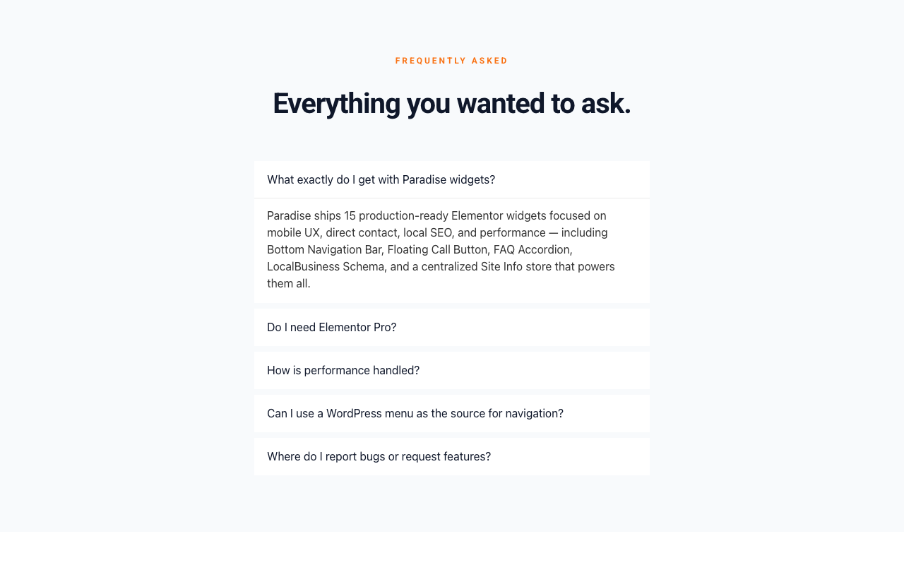
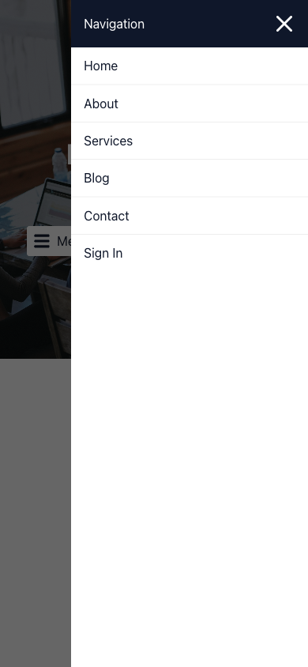
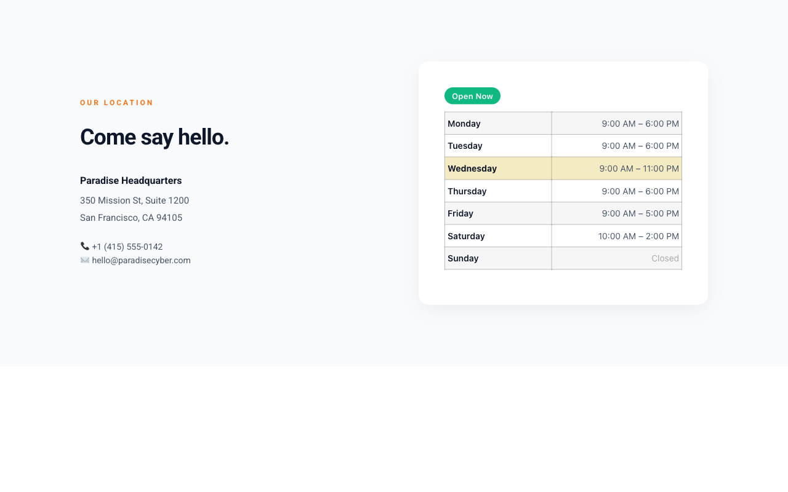

# Paradise Elementor Widgets

**Advanced custom Elementor widgets** focused on mobile experience, direct contact, local SEO, and high performance.

[](https://wordpress.org)
[](https://elementor.com)
[](https://www.php.net)
[](https://github.com/rezabagheri/paradise-elementor-widgets/releases)
[](LICENSE)

---

### Features at a Glance

- **Performance Optimized** — No jQuery (except admin), scoped CSS, assets registered and enqueued per widget
- **Mobile-First** — Special focus on mobile navigation and UX
- **Pixel-Perfect Editor Preview** — All widgets render correctly inside the Elementor iframe
- **Full Dynamic Tags Support** — Phone, address, URLs, and more can be driven by ACF, post meta, or Site Info tags
- **Site Info** — Centralized business data store (phones, emails, addresses, socials, hours) shared across all widgets
- **Local SEO Ready** — LocalBusiness Schema widget outputs JSON-LD for rich Google results
- **No Build Step** — Plain PHP/CSS/JS, no npm required for production use

---

## Screenshots

### Bottom Navigation Bar — mobile

A fixed mobile bottom bar with icons, labels, a prominent speed-dial center button, and an animated active indicator. Active item is detected client-side from the URL — no server round-trip, friendly to page caches.



### Floating Call Button — mobile

A pill or circle call-to-action that stays visible while scrolling. Supports `tel:` or WhatsApp, four corner positions, configurable offsets, custom label, and an optional pulse animation.



### Announcement Bar — desktop

A full-width banner for promotions and updates, with icon, message, CTA button, close button, and dismissal memory (session / X days / forever) stored in localStorage. Fixed to top or bottom of the viewport.



### FAQ Accordion — desktop

Collapsible Q&A — accordion (one open at a time) or multi-expand. Items can be entered manually or pulled from the FAQ Post Type. Outputs Schema.org `FAQPage` JSON-LD for Google rich results.



### Off-Canvas Menu — mobile, open state

A slide-in panel powered by any registered WordPress menu, with a panel header, close button, and overlay-click dismissal. Triggerable from the inline button or programmatically via the `Paradise.openOffCanvas()` JS API (e.g. from Bottom Nav's center button).



### Business Hours — desktop

Renders the active location's weekly schedule from Site Info with a live "Open Now / Closed" badge. Today's row is highlighted; supports 12-hour and 24-hour formats. The badge updates client-side using the site's configured timezone, independent of the visitor's browser TZ.



### Author Card — desktop

A profile card for the current or a specific user — photo, name with optional credentials, professional title, bio (with word-limit truncation), social links from the user's Paradise profile, and an optional CTA button. Pairs with the user-profile fields the plugin adds under Users → Edit.


---

## Available Widgets

| Widget | Description |
| --- | --- |
| **Phone Link** | Clickable phone number with icon, prefix, format options, and `tel:`/WhatsApp link |
| **Phone Button** | Fully-styled CTA button for phone calls or WhatsApp |
| **Floating Call Button** | Fixed-position call/WhatsApp button with pulse animation and corner positioning |
| **Bottom Navigation Bar** | Fixed mobile bottom bar with icons, labels, badges, speed dial, and JS API |
| **Author Card** | Author profile card with photo, credentials, bio, custom fields, and CTA button |
| **Announcement Bar** | Fixed full-width banner with icon, message, CTA, and dismissal memory |
| **Cookie Consent Bar** | GDPR consent bar with Accept/Decline, localStorage expiry, and analytics events |
| **Back to Top** | Fixed button that appears on scroll and returns user to top |
| **Off-Canvas Menu** | Slide-in panel with a WordPress menu, triggerable by button or JS API |
| **Sticky Header** | Makes any Elementor section sticky with scroll shadow/shrink/background effects |
| **Google Map** | Google Map embed via iframe with Place and Directions modes, map types, and zoom |
| **Social Links** | Row/column of social media icon links with brand colors and hover animations |
| **Business Hours** | Business hours from Site Info with a live Open Now / Closed badge |
| **LocalBusiness Schema** | Invisible widget that injects Schema.org JSON-LD for local SEO |
| **FAQ Accordion** | Collapsible Q&A list with accordion or multi-expand mode, icon picker, and Schema.org FAQPage JSON-LD |

---

## Site Info

Site Info is the centralized business data store shared across all widgets. Configure it once under **Paradise → Elementor Widgets** in WordPress admin.

**Stored data:**

- Business name
- Phone numbers (with labels)
- Email addresses (with labels)
- Physical addresses (with labels and Google Map URL)
- Social media links (platform + URL)
- Business hours (per day, open/closed, from/to)

Phone Link, Google Map, Social Links, Business Hours, and LocalBusiness Schema all read from Site Info automatically.

**Shortcode:**

```
[paradise_site_info type="phone"]
[paradise_site_info type="email" index="1"]
[paradise_site_info type="address" label="Main Office"]
[paradise_site_info type="address_map" index="0"]
```

**Dynamic Tags:** Available in Elementor for phone, email, address, address map URL, and social URL fields.

---

## Requirements

- WordPress 6.1 or higher
- Elementor 3.5 or higher (free version is sufficient)
- PHP 8.0 or higher
- Elementor Pro (optional — for Theme Builder and Dynamic Tags on Pro controls)

---

## Installation

1. Clone the repository into your WordPress plugins directory:

```bash
cd wp-content/plugins/
git clone https://github.com/rezabagheri/paradise-elementor-widgets.git
```

2. Activate the plugin from **WordPress Admin → Plugins**.
3. Open Elementor editor — the **Paradise Widgets** category will appear.

---

## File Structure

```
paradise-elementor-widgets/
├── paradise-elementor-widgets.php    # Main plugin file — bootstraps everything
├── admin/
│   ├── class-paradise-ew-admin.php   # Widget registry, settings, menus
│   ├── class-paradise-site-info-admin.php
│   ├── class-paradise-user-profile.php
│   └── views/
│       ├── page-settings.php         # Widget toggle UI
│       └── page-site-info.php        # Site Info editor UI
├── includes/
│   ├── class-paradise-widget-base.php # Abstract base class extended by every widget
│   ├── class-paradise-site-info.php   # Site Info data model + shortcode
│   ├── class-paradise-dynamic-tags.php
│   ├── class-paradise-faq-cpt.php     # FAQ Post Type — sets + TinyMCE meta box
│   └── trait-paradise-phone-helper.php
├── widgets/                          # One file per widget — each extends Paradise_Widget_Base
│   ├── class-paradise-phone-link.php
│   ├── class-paradise-phone-button.php
│   ├── class-paradise-floating-call-btn.php
│   ├── class-paradise-bottom-nav.php
│   ├── class-paradise-author-card.php
│   ├── class-paradise-announcement-bar.php
│   ├── class-paradise-cookie-consent-bar.php
│   ├── class-paradise-back-to-top.php
│   ├── class-paradise-off-canvas-menu.php
│   ├── class-paradise-sticky-header.php
│   ├── class-paradise-google-map.php
│   ├── class-paradise-social-links.php
│   ├── class-paradise-business-hours.php
│   ├── class-paradise-local-business-schema.php
│   └── class-paradise-faq-accordion.php
└── assets/
    ├── css/                          # One CSS file per widget
    └── js/                           # JS only for widgets that need it
```

---

## Developer Guide

### Adding a new widget

1. Create `widgets/class-paradise-{slug}.php` with a class extending `Paradise_Widget_Base`:

```php
<?php
if ( ! defined( 'ABSPATH' ) ) exit;

class Paradise_My_Widget_Widget extends Paradise_Widget_Base {

    public function get_name(): string    { return 'paradise_my_widget'; }
    public function get_title(): string   { return esc_html__( 'My Widget', 'paradise-elementor-widgets' ); }
    public function get_icon(): string    { return 'eicon-star'; }
    public function get_keywords(): array { return [ 'my', 'widget' ]; }

    // get_categories() and get_style_depends() come from the base.
    // Defaults: [ 'paradise' ] category and [ 'paradise-{slug}' ] style handle.
    //
    // Add this only if the widget ships a JS file:
    // public function get_script_depends(): array { return [ $this->get_default_handle() ]; }

    protected function register_controls(): void { /* ... */ }
    protected function render(): void { /* ... */ }
}
```

2. Add one entry to `$widget_registry` in `admin/class-paradise-ew-admin.php`:

```php
'my_widget' => [
    'label'       => 'My Widget',
    'description' => 'Short description for the settings toggle page.',
    'js'          => true,   // only if the widget ships a JS file; omit otherwise
],
```

The `file` path and `class` name are derived automatically from the registry key by convention:
`'my_widget'` → file `widgets/class-paradise-my-widget.php` → class `Paradise_My_Widget_Widget`.

3. Place asset files at the conventional paths — they will be registered automatically:
    - `assets/css/my-widget.css`  (required)
    - `assets/js/my-widget.js`  (only if `'js' => true` in the registry)

Nothing else to touch. The main plugin file iterates the registry to register handles, the settings page auto-lists the widget with a toggle, and the widget loader auto-instantiates it.

### Need extra asset dependencies?

If the widget needs more than the conventional `paradise-{slug}` handle (e.g. Bottom Nav loads the bundled Font Awesome stylesheets so user-picked icons render), override `get_style_depends()` and merge on top of the base default:

```php
public function get_style_depends(): array {
    return array_merge( parent::get_style_depends(), [
        'elementor-icons-fa-solid',
        'elementor-icons-fa-brands',
    ] );
}
```

### Learning from the example widget

The plugin ships a fully-working reference widget at:

```
widgets/class-paradise-feature-card-example.php
```

It's heavily commented — every section, every control, every render decision is annotated with what it does and **why**. Read it top to bottom to see every pattern you'll need:

- extending `Paradise_Widget_Base` (and when to override its defaults)
- overriding `get_categories()` to land in a different editor category
- splitting `register_controls()` into per-section private methods
- every common control type (`TEXT`, `TEXTAREA`, `ICONS`, `URL`, `COLOR`, `SLIDER`, `DIMENSIONS`, `CHOOSE`)
- group controls (Typography, Border, Box Shadow)
- `add_responsive_control()` for per-breakpoint values
- conditions that hide controls reactively (`'link[url]!' => ''`)
- the `{{WRAPPER}}` selector pattern that scopes CSS to the widget instance
- `start_controls_tabs()` for Normal / Hover state pairs
- safe rendering with `esc_html()`, `wp_kses_post()`, `Icons_Manager::render_icon()`, and `add_link_attributes()`

The example widget lives in its own **Paradise Examples** editor category (separate from the production **Paradise Widgets** category) and is **disabled by default** in the settings. End-user sites won't see it. Turn it on under *Paradise → Elementor Widgets* when you want to inspect it inside Elementor.

### Constants

| Constant | Value |
| --- | --- |
| `PARADISE_EW_VERSION` | Current plugin version |
| `PARADISE_EW_DIR` | Absolute path to plugin directory (trailing slash) |
| `PARADISE_EW_URL` | URL to plugin directory (trailing slash) |

### Code conventions

- PHP 8.0+ — typed return types, `mixed` parameter types, arrow functions where appropriate
- No `!important` in CSS
- CSS class prefix is widget-specific (e.g. `paradise-bn-*`, `paradise-ab-*`)
- All output escaped: `esc_html`, `esc_url`, `esc_attr`
- JS: vanilla, no jQuery dependency, IIFE pattern

---

## Version History

### v2.7.0 (May 2026)

- Feature Card example widget — heavily-commented reference for developers in its own "Paradise Examples" category, disabled by default
- New optional registry flags: `example` (metadata) and `default` (per-widget enabled-by-default state)
- Site Info admin page rebuilt — distinct location cards, sub-section dividers, icon-only Remove/Add buttons, intro rewritten as a two-method callout (Dynamic Tags + shortcode)
- Per-row Copy Shortcode buttons on phones / emails / socials with "Copied!" toast feedback; brand-coloured platform icons next to each social select
- Settings page grouped into Production / Developer Examples / Features cards with Enable all / Disable all bulk actions and a live filter input; "Off by default" badge
- "Unsaved changes" pill in admin headers with `beforeunload` guard
- Fixed: Copy Shortcode now works on plain HTTP (Valet `*.test`) via `execCommand` fallback; Google Maps preview validates the embed URL before loading

### v2.6.0 (May 2026)

- `Paradise_Widget_Base` abstract class — small shared base inherited by every bundled widget; provides default `get_categories()`, conventional `paradise-{slug}` asset handle naming from `get_name()`, and a `get_default_handle()` helper
- All 15 bundled widgets migrated to extend `Paradise_Widget_Base`, dropping repeated `get_categories()` and `get_style_depends()` overrides

### v2.5.0 (May 2026)

- Registry-driven asset registration — `enqueue_assets()` reduced from ~170 hardcoded calls to a single loop over the widget registry
- Asset handle naming normalized to `paradise-{slug}` for both CSS and JS of each widget
- Minimum PHP raised from 7.4 to 8.0 to match the codebase
- Elementor compatibility admin notices — shown when Elementor is missing or older than 3.5.0; widget/asset registration is skipped on outdated Elementor to avoid fatals
- Fixed: Bottom Navigation Bar asset handle mismatch left the widget unstyled and non-interactive on the frontend
- Fixed: Floating Call Button corner offsets now apply to the position-fixed inner wrapper (not the static outer wrapper)
- Fixed: FAQ Accordion — closed items no longer leak the first line of the answer (`grid-template-rows: minmax(0, 0fr)`); no more `TypeError` on canvas templates where `elementorFrontend.hooks` is not yet ready
- README gains a Screenshots section with seven viewport-correct widget screenshots

### v2.4.0 (April 2026)

- FAQ Accordion widget — accordion/multi-expand, Elementor icon picker (closed/open), icon position, Schema.org FAQPage JSON-LD, full style controls
- FAQ Post Type — each post is a "FAQ Set" with unlimited Q&A items stored in meta; TinyMCE rich text editor for answers; toggle on/off in plugin settings
- Fixed: Elementor editor CSS appearing as visible text when FAQ CPT source was active (caused by `apply_filters('the_content', …)` inside widget render)

### v2.3.0 (April 2026)

- Site Info centralized data store with shortcode and Dynamic Tags
- 9 new widgets: Business Hours, LocalBusiness Schema, Google Map, Social Links, Announcement Bar, Cookie Consent Bar, Back to Top, Off-Canvas Menu, Sticky Header
- Widget registry as single source of truth — adding a widget now requires one registry entry

### v2.2.0 (April 2026)

- WhatsApp support in Phone Link and Phone Button
- WooCommerce cart badge in Bottom Nav
- Schema.org Person markup on Author Card
- JS Hook system for Bottom Nav center button

### v2.1.0 (April 2026)

- Rebranded from Glenar to Paradise
- Elementor native responsive visibility for Bottom Nav
- Pixel-perfect editor preview

### v2.0.0 (January 2025)

- Removed all `!important` from CSS
- CSS variables for theming

### v1.0.0 (January 2024)

- Initial release: Phone Link, Bottom Navigation Bar

---

## Support & Contact

- **Issues**: [GitHub Issues](https://github.com/rezabagheri/paradise-elementor-widgets/issues)
- **Website**: [https://paradisecyber.com](https://paradisecyber.com)
- **Email**: rezabagheri@gmail.com

---

## License

Licensed under the **GPL-2.0+** license. See the [LICENSE](LICENSE) file for details.
